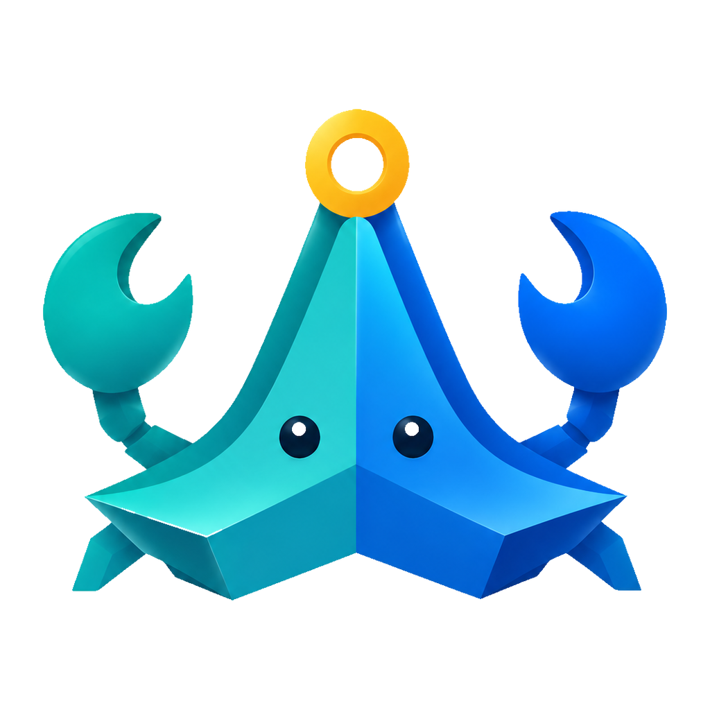

<p align="center">
  
</p>

# TS Phone

TS Phone is the mobile companion for [TSPi](https://github.com/iawnix/TSPi).
It lets you browse transition-state research workspaces, follow Pi sessions,
and continue a conversation from your phone without keeping a terminal open.

This repository contains the Flutter app, a small TypeScript broker, the shared
protocol definitions, and component release tooling. TS Phone runs alongside
TSPi; it is not a general-purpose Pi client or a research runtime by itself.

## What it does

- Browse live and persisted Pi sessions, including earlier conversation branches.
- Create, rename, archive, restore, and delete projects and conversations.
- Follow messages, tool calls, research activity, failures, and run status over SSE.
- Send from Phone or terminal into one workspace queue; choose the model for the next message.
- See the active model and Pi's context-window estimate when the Bridge reports them.
- Use an English or Chinese interface with light and dark themes, large text, and reduced motion.

## How it fits together

```text
Flutter app
    |
    | HTTPS + SSE
    v
reverse proxy
    |
    | loopback HTTP
    v
TS Phone broker
    |                 |
    | starts Worker   | authenticated Unix socket
    v                 v
TSPi/Pi process <-> TSPi Bridge
```

TSPi owns scientific state and Pi session files. The Host handles phone
authentication, project/session metadata, live routing, persisted history, and
the lifecycle of TSPi Workers it starts. Pi JSONL is the conversation history;
the Host separately persists pending requests and bounded delivery receipts.

Several clients may view a project at once. Messages execute in arrival order,
one Agent turn per workspace. Host starts the requested conversation when its
turn arrives; switching views does not interrupt research. Different workspaces
can execute independently. TSPi's single-writer lock remains the final guard.

## Requirements

- Node.js 22.19 or newer and npm for the broker
- Flutter 3.44 or newer with Dart `>=3.12.0 <4.0.0` for mobile development
- TSPi 0.15.0 for shared terminal/Phone sessions; Bridge v3 for live transport
- An HTTPS origin reachable from the phone for remote use

The broker listens only on `127.0.0.1` or `::1`. A reverse proxy must terminate
TLS because the mobile app rejects plain HTTP for non-loopback addresses.
Stopping generation is fenced by both the current session revision and the
exact Bridge-issued agent run ID, so a delayed phone request cannot stop a
newer run.

## Run from source

Install dependencies and start the broker from the repository root:

```bash
git clone https://github.com/iawnix/ts-phone.git
cd ts-phone
npm ci

export TS_PHONE_WORKSPACES=/absolute/path/to/tspi/workspaces
export TS_PHONE_TSPI=/absolute/path/to/tspi/TSPi
export TS_PHONE_STATE_DIR=/absolute/path/to/ts-phone-dev/state
export TS_PHONE_BRIDGE_SOCKET=/absolute/path/to/ts-phone-dev/run/bridge.sock
export TS_PHONE_BRIDGE_SECRET_FILE=/absolute/path/to/ts-phone-dev/state/bridge.secret
npm run dev
```

These paths must be absolute, and `TS_PHONE_WORKSPACES` must already be a real,
non-symlink directory. First startup creates separate API and Bridge credentials
at the configured paths with owner-only permissions.

In another terminal, check the service and read the API token locally:

```bash
curl http://127.0.0.1:22113/healthz
TS_PHONE_STATE_DIR=/absolute/path/to/ts-phone-dev/state npm run ctl -- token
```

The app opens to recent conversations and projects. Creating a conversation or
reading history does not start a Worker. With `TS_PHONE_TSPI` configured, choose
the next-message model and send normally. The Host saves the request before
execution and waits for the workspace's current turn to finish. The app shows
waiting, running, or interrupted requests and allows waiting requests to be
cancelled. Ordinary conversations have no read-only/research mode selector.
Explicit standalone Observer sessions remain supported, but are not required
for viewing. External/native Pi runtimes are never stopped by the queue.
The configured launcher must advertise `tspi-session-guard/1`. A manually started
phone session remains supported for diagnostics:

```bash
TS_PHONE_BRIDGE_SOCKET=/absolute/path/to/ts-phone-dev/run/bridge.sock \
TS_PHONE_BRIDGE_SECRET_FILE=/absolute/path/to/ts-phone-dev/state/bridge.secret \
  /path/to/tspi/TSPi --workspace WORKSPACE --standalone --phone
```

Run the broker and TSPi as the same Unix user so both can access the protected
socket and secret.

Installed `TSPi` now opens a thin terminal client of this Host by default;
`--phone` is an alias. Browsing or detaching does not start or stop a Worker.
Use `--standalone` only when native Pi owns the session. See the TSPi
[terminal guide](https://github.com/iawnix/TSPi/blob/ts-hypothesis-loop/docs/TERMINAL.md).

Run the mobile app on a connected development device:

```bash
cd apps/mobile
flutter pub get
flutter devices
flutter run -d DEVICE_ID
```

This starts the client UI. Completing an end-to-end connection also requires an
HTTPS origin reachable from the device. Enter that origin and the API token in
the app; the broker stays on loopback, as described in the
[deployment guide](docs/deployment.md).

Production installation uses the TSPi Package, which ships compatible versions
of the research runtime, broker, Web explorer, and Android app.

## Development checks

Run the broker checks from the repository root:

```bash
npm run typecheck
npm test
npm run test:release
npm run build
TS_PHONE_SMOKE_PORT=23113 npm run smoke
```

Run the mobile checks from `apps/mobile`:

```bash
dart format --output=none --set-exit-if-changed lib test
flutter analyze
flutter test
```

Android signing and component packaging are maintainer workflows documented in
[Build artifacts](docs/artifacts.md).

## Security

Treat the API token as remote controller access. It can create projects and
sessions, start TSPi Workers, submit prompts, change lifecycle state, and request
permanent deletion. Queued phone turns have the same registered tool authority
as local Controller turns. This is a trusted single-user interface, not a
low-privilege read-only account.

Project deletion is fail-closed: TSPi must report no active Worker, remote
calculation, pending approval, queued request, or unresolved remote effect. Recently Deleted is
manual retention, not a timed cleanup service. Permanent deletion requires the
exact resource ID and cannot be undone.

The projection drops thinking and raw provider records, but it is not a secret
redaction layer. Visible text, tool arguments, and tool results can still
contain sensitive information. Do not put credentials in conversations,
screenshots, logs, or source control.

Read the [security model](docs/security.md) before making the service reachable
from another device.

## Platform status

| Component | Current status |
| --- | --- |
| Host | 0.9.1; API v4, Events v3, Bridge v3, `terminal.attach` |
| Android | App 0.18.3+48; Android 7.0 or newer |
| TSPi compatibility | TSPi 0.15.0; terminal attach, exact-session Workers and lifecycle guards |
| iOS | Flutter source is included; no IPA is produced on Linux. Building requires macOS and Apple signing. |

These are source versions. See [release records](docs/artifacts.md) for published
artifacts; changing this table does not deploy an upgrade.

## Documentation

- [Architecture](docs/architecture.md): ownership, sessions, synchronization, and recovery boundaries
- [Security](docs/security.md): trust model, credentials, projection, and remote-control risks
- [Deployment](docs/deployment.md): TSPi Package integration, service activation, HTTPS, and rollback
- [Recovery](docs/recovery.md): reconnects, offline history, and ambiguous commands
- [Build artifacts](docs/artifacts.md): Android releases and component archives

## License

This repository does not currently include a license. Until one is added,
normal copyright restrictions apply.
